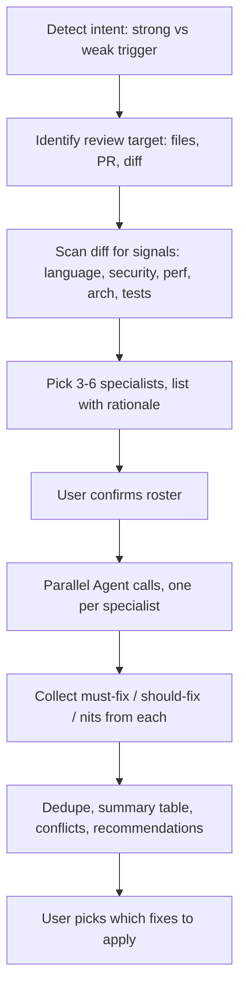

# empire-dev

Development collaboration: parallel specialist code review plus a bundled roster of dev subagents covering generalist review, paradigm specialists, and domain experts.

Part of the [empire](../../README.md) marketplace.

## Install

```sh
/plugin marketplace add marcoskichel/empire
/plugin install empire-dev@empire
```

Or install the full empire bundle (which includes this plugin):

```sh
/plugin install empire@empire
```

## Skills

### `team-review`

Spawn parallel specialist subagents to review a diff or PR, then consolidate findings into a single deduplicated report. The skill detects signals in the diff (language, security surface, architectural change, perf hotspots, tests), picks 3–6 specialists from the available roster, dispatches them in parallel, and merges their findings into a prioritized must-fix / should-fix / nits list. Findings stay local — never posted to GitHub.

**Triggers (strong, dispatch immediately):** "team review", "specialist review", "have specialists review", "ask the team", "parallel review", "have the team look", "re-review", "another pass".

**Triggers (weak, skill confirms before dispatch):** "review my changes", "review again", "look at this".



**Source:** [`skills/team-review/SKILL.md`](skills/team-review/SKILL.md)

## Bundled agents

Code review:

| Agent                  | Use                                              |
| ---------------------- | ------------------------------------------------ |
| `code-reviewer`        | Generalist code review (security, perf, quality) |
| `debugger`             | Root-cause analysis of errors and test failures  |
| `test-automator`       | Test strategy, frameworks, TDD, CI quality gates |
| `security-auditor`     | Auth, crypto, OWASP, threat modeling, compliance |
| `architect-review`     | Clean architecture, microservices, DDD, SOLID    |
| `performance-engineer` | Profiling, bottlenecks, caching, observability   |

Paradigm specialists:

| Agent                           | Use                                                       |
| ------------------------------- | --------------------------------------------------------- |
| `functional-programming-expert` | Purity, immutability, totality, composition, ADT modeling |
| `concurrency-reviewer`          | Race conditions, deadlocks, async / await correctness     |
| `type-system-expert`            | Type design, invariants, generics, GADTs, branded types   |

Domain experts:

| Agent                  | Use                                                  |
| ---------------------- | ---------------------------------------------------- |
| `blockchain-developer` | Smart contracts, DeFi, Web3, gas optimization, audit |
| `ai-engineer`          | LLM apps, RAG, agents, prompts, vector search        |

The `team-review` skill auto-discovers whatever specialist subagents are installed and picks the best match per task. If your environment has more specialized subagents from another marketplace, the skill will use them.

## Upstream attribution

Modifications and source: [`agents/NOTICE.md`](agents/NOTICE.md).
