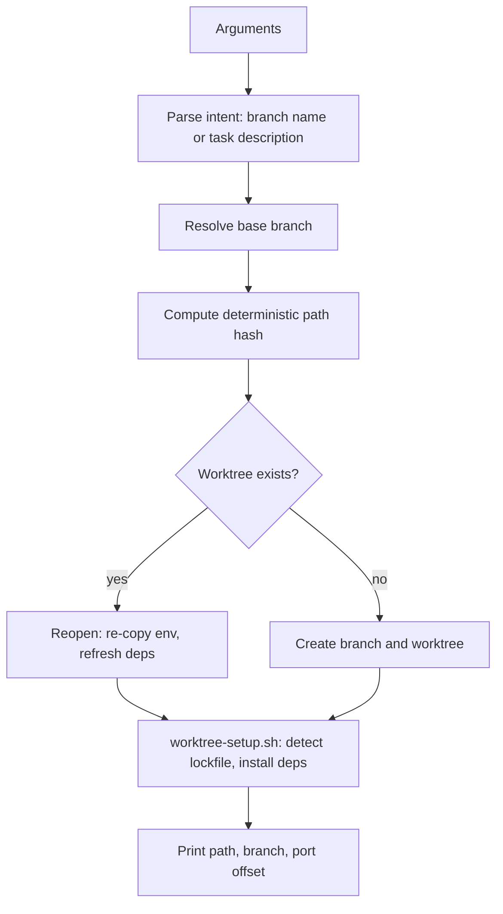
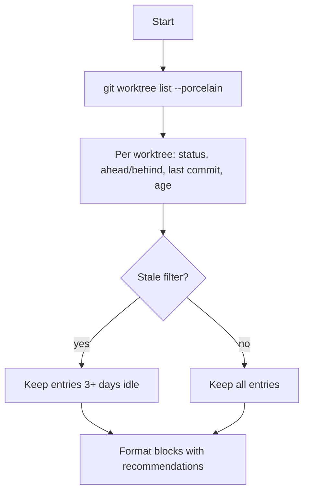
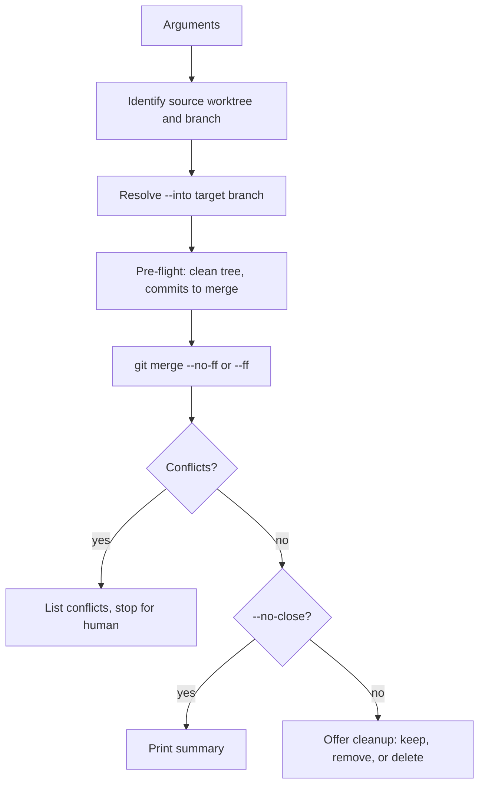
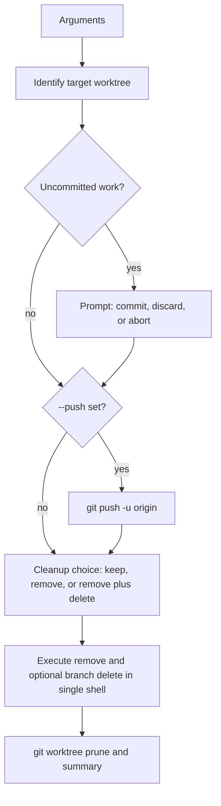
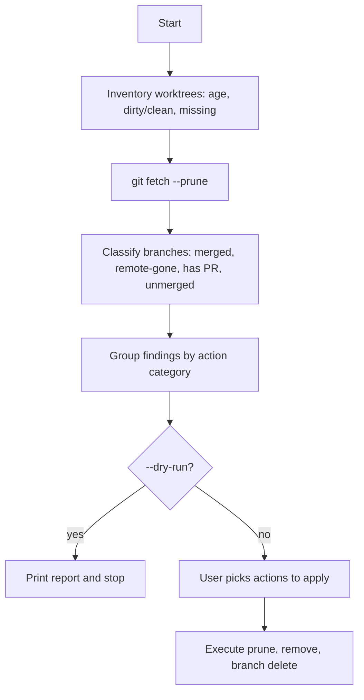
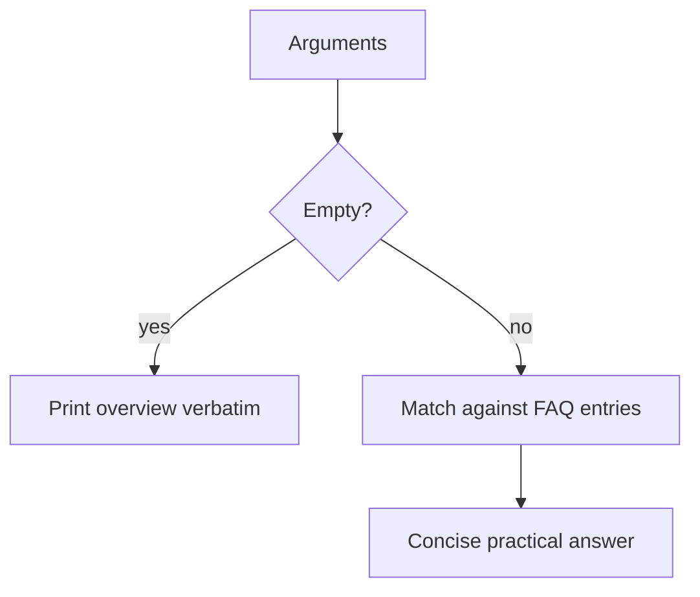
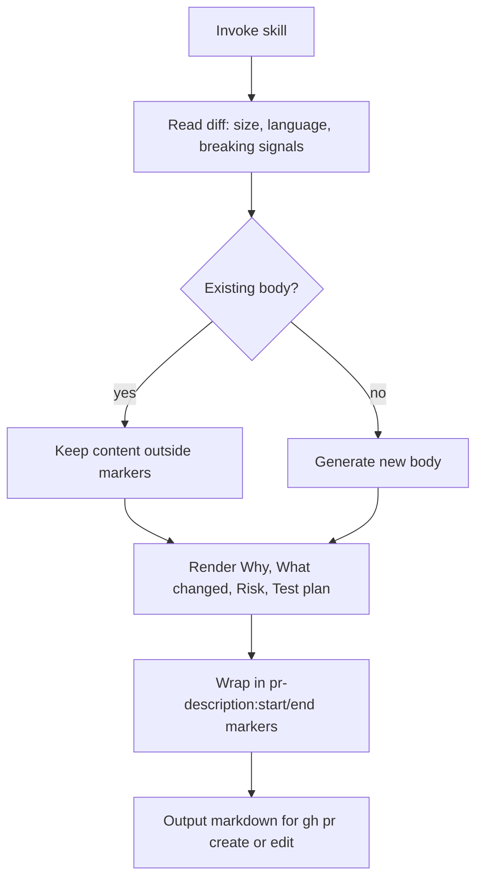

# empire-git

Git workflow skills: parallel worktree lifecycle and PR description templating.

Part of the [empire](../../README.md) marketplace.

## Install

```sh
/plugin marketplace add marcoskichel/empire
/plugin install empire-git@empire
```

Or install the full empire bundle (which includes this plugin):

```sh
/plugin install empire@empire
```

## Skills

### `worktree-open`

Create or reopen an isolated git worktree for parallel development. Derives a deterministic path from the branch name (so the same branch always maps to the same worktree), copies `.env*` files, runs the matching dependency install, and prints the path so you can launch a Claude Code session or VSCode window in it.

**Triggers:** "open a worktree", "spin up a branch", "work on X separately", "in parallel", "start a parallel task", "isolated environment for an agent", "side branch without switching".

**Usage:** `/empire-git:worktree-open [branch | task description] [--base <branch>]`



**Source:** [`skills/worktree-open/SKILL.md`](skills/worktree-open/SKILL.md), [`scripts/worktree-setup.sh`](scripts/worktree-setup.sh)

### `worktree-list`

Read-only inventory of active worktrees with branch, dirty/clean status, ahead/behind counts, last commit, and staleness. Never modifies anything.

**Triggers:** "list worktrees", "show my worktrees", "what worktrees do I have", "what's in flight", "any forgotten worktrees", "stale worktrees".

**Usage:** `/empire-git:worktree-list [--stale]`



**Source:** [`skills/worktree-list/SKILL.md`](skills/worktree-list/SKILL.md)

### `worktree-merge`

Fold one worktree's branch into another local branch using `git merge` (defaults to `--no-ff`). Useful for batching small fixes into one branch before opening a single PR, or folding sub-feature branches back into a parent.

**Triggers:** "merge this worktree into X", "fold sub-branches back", "combine worktree branches", "merge feat/X into main locally".

**Usage:** `/empire-git:worktree-merge <branch> --into <target> [--no-close] [--ff]`



**Source:** [`skills/worktree-merge/SKILL.md`](skills/worktree-merge/SKILL.md)

### `worktree-close`

Finish work in a single worktree: optional push, remove the worktree, and let you choose whether to delete the branch. Uses safe delete (`git branch -d`) to flag unmerged work.

**Triggers:** "close this worktree", "I'm done with this worktree", "wrap up this branch", "push and remove", "tear down this worktree".

**Usage:** `/empire-git:worktree-close [branch] [--push] [--discard] [--force]`



**Source:** [`skills/worktree-close/SKILL.md`](skills/worktree-close/SKILL.md)

### `worktree-cleanup`

Batch housekeeping: scan for stale worktrees and orphaned branches, classify them (stale, missing, merged orphan, remote deleted, has open PR), then let you pick what to clean up. `--dry-run` previews without changes.

**Triggers:** "stale worktrees", "orphan branches", "prune worktrees", "clean up old branches", "purge stale worktrees", "housekeeping".

**Usage:** `/empire-git:worktree-cleanup [--dry-run] [--days N]`



**Source:** [`skills/worktree-cleanup/SKILL.md`](skills/worktree-cleanup/SKILL.md)

### `worktree-help`

Natural-language FAQ for the worktree toolkit. Answers questions about VSCode integration, port offsets, env file handling, dependency installs, and typical workflows. With no arguments, prints the overview.

**Triggers:** "how do I open this in VSCode", "why is .env copied", "what about port collisions", "worktree workflow", "show me the worktree FAQ".

**Usage:** `/empire-git:worktree-help [question]`



**Source:** [`skills/worktree-help/SKILL.md`](skills/worktree-help/SKILL.md)

### `pr-description`

Canonical PR description template. Senior-reviewer voice, ≤200 words, sections for Why / What changed / Risk / Test plan, idempotent `<!-- pr-description:start/end -->` markers so user-added content (screenshots, `Fixes #N`, task lists) survives updates. Pure content template — output goes to stdout for the caller to pipe into `gh pr create --body-file -` or `gh pr edit --body-file -`.

**Triggers:** "PR description", "PR body", "pull request description", "PR summary", "PR template", "GitHub PR body", "draft a PR", "write the PR", "summarize this branch for review", "regenerate PR body".



To make it impossible for the agent to bypass, add this one-line rule to your project or user CLAUDE.md:

```
- Before any `gh pr create --body*` or `gh pr edit --body*`, MUST invoke the `pr-description` skill and use its output verbatim.
```

**Source:** [`skills/pr-description/SKILL.md`](skills/pr-description/SKILL.md)

## Upstream attribution

Worktree skills inspired by [`@thinkvelta/claude-worktree-tools`](https://github.com/ThinkVelta/claude-worktree-tools) (MIT).
