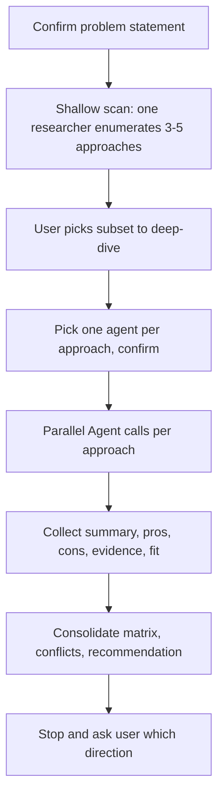
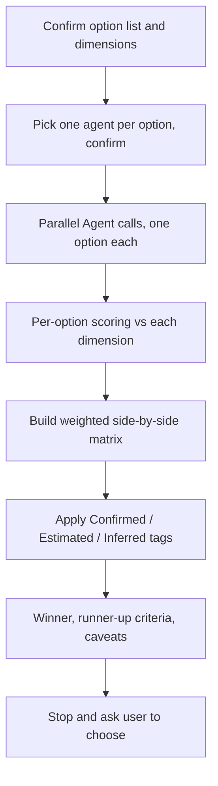

# empire-research

Research collaboration: open-ended exploration plus closed comparison, with consolidated reports. Two skills, one bundled subagent.

Part of the [empire](../../README.md) marketplace.

## Install

```sh
/plugin marketplace add marcoskichel/empire
/plugin install empire-research@empire
```

Or install the full empire bundle (which includes this plugin):

```sh
/plugin install empire@empire
```

## Skills

### `explore`

Open-ended approach exploration. Use when the solution space is open: you know the problem, not the options. The skill confirms the problem, dispatches a shallow scan to enumerate 3–5 candidate approaches, lets you pick a subset to deep-dive, dispatches one researcher per approach in parallel, and produces a consolidated report with a recommended direction. Findings stay local — never posted externally.

**Triggers:** "explore options", "what could we do for X", "research approaches", "investigate approaches", "spawn research team", "what are the options", "options analysis", "explore solutions", "have the team explore".



**Source:** [`skills/explore/SKILL.md`](skills/explore/SKILL.md)

### `compare`

Closed comparison of a known set of options head-to-head. Use when you already have options A, B, C and want a side-by-side matrix. The skill confirms the option list and decision dimensions, dispatches one agent per option in parallel, and consolidates a weighted matrix with a winner, runner-up criteria, and caveats. Confidence-tagged data. Findings stay local.

**Triggers:** "compare libs", "compare frameworks", "evaluate options", "side by side", "head to head", "X vs Y", "which is better", "tooling comparison", "weigh these options", "decide between these".



**Source:** [`skills/compare/SKILL.md`](skills/compare/SKILL.md)

## Bundled agents

| Agent              | Use                                                   |
| ------------------ | ----------------------------------------------------- |
| `research-analyst` | Multi-source research synthesis, broad info retrieval |

Both skills auto-discover whatever specialist subagents are installed and pick the best match per task. If your environment has more specialized subagents from another marketplace, the skills will use them.

## Upstream attribution

Source and license: [`agents/NOTICE.md`](agents/NOTICE.md).
